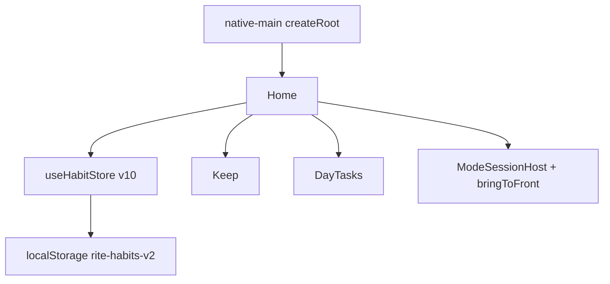

# Rite — project knowledge graph

Read **`TODO.md` first**, then this file, before re-exploring `src/`.
Edit in place. Do not re-scaffold.

---

## 1. Product

| | |
|---|---|
| Name | Rite |
| One-liner | Daily rites + dated tasks, streaks, study lock, encrypted backup |
| Auth / DB | **OFF.** Zustand + `localStorage` (`rite-habits-v2`, persist **v10**) |
| Max habits | 16 |
| Week start | Monday |
| GitHub | https://github.com/Maya920tu/Rite |

Web/PWA is the live product. Capacitor (`app.rite.habits`) loads **`dist-native`**.

---

## 2. Screenshot bugs (2026-09-24)

| What you saw | Cause | Fix |
|---|---|---|
| v0.2 “Update” then fail; uninstall wiped rites | Each CI run made a **new debug signature**. Android will not update across signatures. | Commit `native/rite-debug.keystore`; inject as `signingConfigs.debug`. Same key → in-place update keeps WebView localStorage. |
| First open already ticked past days (11d / 83%) | Store default was `createSeed()` demo history. | Default **empty**. Sample only from empty-state. Banner if current data is still the sample ids. |
| WEEK **66** | Loop-style **score 0–100**, not ISO week 66 of the year. | Label **Score**, value **66%**. Streak 11d is current streak. |
| Study: swipe recents / Home and lock is gone | Overlay + `startLockTask` only if pinning is allowed. Force-stop / Recents still kills the activity. | Persist session (reopen returns to lock), pin on start, `bringToFront` + slip on background, copy Digital Wellbeing Focus. **Cannot** block YouTube by name without OS Focus. |
| Uninstall lost data | App storage dies with the app. Cloud backup is **user-initiated**. | Same-key updates; autosave file; empty-state Restore. |

---

## 3. Architecture



---

## 4. Own files

```
src/routes/index.tsx
src/native-main.tsx
src/lib/habits/{types,store,stats,dates,backup,pact,remind,guards,seed,clock,autosave}.ts
src/lib/platform/{rite-lock,runtime,notifications,haptics,install}.ts
src/components/{keep-panel,day-tasks,rite-runner,pact-view,habit-card,mode-lock,stats-strip,empty-state}.tsx
native/rite-debug.keystore   ← NEVER rotate without a migration plan
native/rite-lock/android/{RiteLockPlugin.java,RiteWidgetProvider.java}
capacitor.config.ts  webDir = dist-native
```

Do not touch: `public/__grok/`, `server/`, `scripts/grok-pwa-*`, `src/lib/auth/*`, `src/lib/db.ts`, `startup.sh`.

---

## 5. Domain (v10)

- Habit / completions / skips / freeze (1/week)
- **DayTask**: `{ id, title, notes, dateKey, done, remindAt }` — reminder skipped if already done
- routines, pacts, ModeSession, Guards
- Default habits: **[]**. `loadSample()` still paints demo history.

Score: last 7 scheduled days, done=1 skip=0.7 miss=0, shown as **Score nn%**.

---

## 6. Native

| | Honest limit |
|---|---|
| In-place APK update | Pin `native/rite-debug.keystore` + `native/rite-debug.sha256` (`C79734F4…4B0C`). Inject **after** `cap sync`. CI runs `native/verify-apk-cert.mjs` and **fails** if Gradle used the runner debug key. Optional secret `RITE_DEBUG_KEYSTORE_BASE64`. |
| Study swipe-away | Pin + bringToFront. Recents/force-stop still possible without Digital Wellbeing Focus / Guided Access. |
| Data vs uninstall | localStorage dies. Encrypted Keep backup is the cloud path. |

CI tag **v0.1.0** (history was squashed; old GitHub releases removed). Uninstall any pre-v0.1.0 sideload APK — those used a different key.

---

## 7. Resume

1. `TODO.md` open rows.
2. This file.
3. Do not kill `startup.sh`.
4. Typecheck + smoke + `npm run native:web` (index.html must use `./assets/`).
